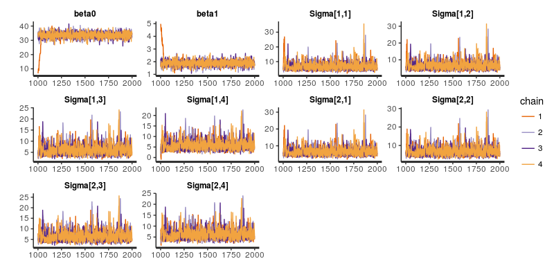
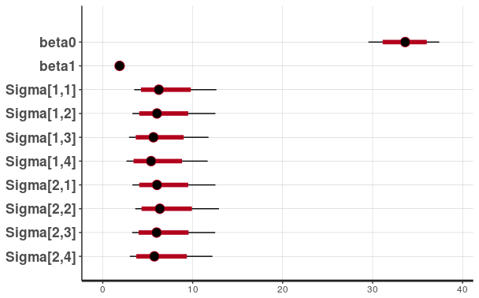
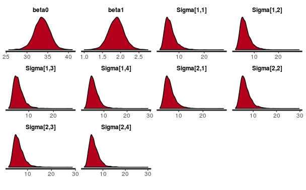

* Elston and Grizzle (1962) presented repeated measurements of ramus (jaw) bone height on a 
cohort of 20 boys over an 18 month period. Interest focuses on describing the average growth curve of the ramus bone. The four measurements **Y** for each child i are assumed to be correlated and follow a multivariate normal (MVN) distribution.
<br />

### R Code (Stan) 
```{r eval=FALSE}
library(rstan)
rstan_options(auto_write = TRUE)
options(mc.cores = parallel::detectCores())
M1 = 4
N1 = 20
Y1 = structure(c(47.8, 46.4, 46.3, 45.1, 47.6, 52.5, 51.2, 49.8, 48.1, 
              45, 51.2, 48.5, 52.1, 48.2, 49.6, 50.7, 47.2, 53.3, 46.2, 46.3, 
              48.8, 47.3, 46.8, 45.3, 48.5, 53.2, 53, 50, 50.8, 47, 51.4, 49.2, 
              52.8, 48.9, 50.4, 51.7, 47.7, 54.6, 47.5, 47.6, 49, 47.7, 47.8, 
              46.1, 48.9, 53.3, 54.3, 50.3, 52.3, 47.3, 51.6, 53, 53.7, 49.3, 
              51.2, 52.7, 48.4, 55.1, 48.1, 51.3, 49.7, 48.4, 48.5, 47.2, 49.3, 
              53.7, 54.5, 52.7, 54.4, 48.3, 51.9, 55.5, 55, 49.8, 51.8, 53.3, 
              49.5, 55.3, 48.4, 51.8), .Dim = c(20, 4))
age1 = c(8, 8.5, 9, 9.5)
S1 = structure(c(1, 0, 0, 0, 0, 1, 0, 0, 0, 0, 1, 0, 0, 0, 0, 1), .Dim = c(4, 
                                                                        4))
stan_code = '
data {
  int<lower=0> N; 
  int<lower=0> M; 
  vector[M] Y[N]; 
  real age[M]; 
  cov_matrix[M] S; 
} 

transformed data {
  real mean_age;
  mean_age = mean(age); 
} 


parameters {
  real beta0; 
  real beta1; 
  cov_matrix[M] Sigma; 
} 

transformed parameters {
  vector[M] mu;
  // for (m in 1:M) mu[m] = beta0 + beta1 * (age[m] - mean_age); 
  
  for (m in 1:M)  
    mu[m] = beta0 + beta1 * age[m]; 
}  
model {
  beta0 ~ normal(0, 32);
  beta1 ~ normal(0, 32);
  Sigma ~ inv_wishart(4, S); 
  for (n in 1:N) 
    Y[n] ~ multi_normal(mu, Sigma); 
} 
'
stan_run = stan(data = list(N = N1,
                            M = M1,
                            y = Y1,
                            age = age1,
                            S = S1),
                model_code = stan_code)
rstan::traceplot(stan_run)
plot(stan_run)
pars = extract(stan_run)
str(pars)
stan_dens(stan_run)
```
* Output


```
#' ci_level: 0.8 (80% intervals)
#' outer_level: 0.95 (95% intervals)


List of 5
 $ beta0: num [1:4000(1d)] 34.2 34.2 34.9 34.6 38.5 ...
  ..- attr(*, "dimnames")=List of 1
  .. ..$ iterations: NULL
 $ beta1: num [1:4000(1d)] 1.84 1.7 1.82 1.8 1.36 ...
  ..- attr(*, "dimnames")=List of 1
  .. ..$ iterations: NULL
 $ Sigma: num [1:4000, 1:4, 1:4] 5.4 10.17 4.67 4.59 4.99 ...
  ..- attr(*, "dimnames")=List of 3
  .. ..$ iterations: NULL
  .. ..$           : NULL
  .. ..$           : NULL
 $ mu   : num [1:4000, 1:4] 48.9 47.8 49.5 49 49.3 ...
  ..- attr(*, "dimnames")=List of 2
  .. ..$ iterations: NULL
  .. ..$           : NULL
 $ lp__ : num [1:4000(1d)] -43.8 -58.6 -47.8 -44.3 -52.7 ...
  ..- attr(*, "dimnames")=List of 1
  .. ..$ iterations: NULL
```

* **Traceplot**





* **Simple Plot**  





* **Dense Plot**




